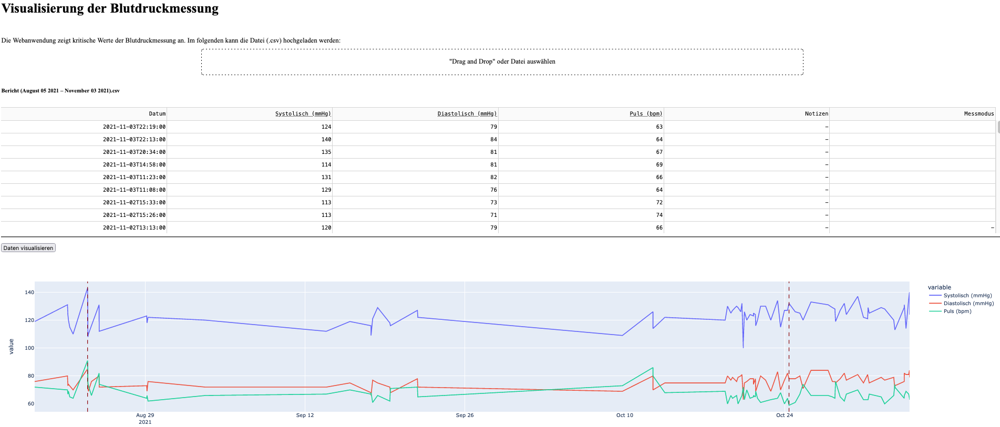

= Blood Measurement Dashboard

Die Web-Applikation ermöglicht die Visualisierung von Messwerten aus Blutdruck-Messungenfootnote:[Unterstützt nur das deutsche Datumsformat (z.B. 3. November 2021), das vom Gerät generiert wird.].
Sie zielt darauf ab, kritische Werte auf der Grundlage von Schwellenwerten für systolische und diastolische Werte, sowie den Puls zu identifizieren.
Die Daten werden beim Hochladen in eine sqlite Datenbank gespeichert und können dann als Zeitreihendiagramm angezeigt werden.
Das Dashboard wurde mit https://plotly.com/dash/[Dash] entwickelt.

The web application allows for visualization of measurement values from blood pressure readingsfootnote:[Only supports the German date format (e.g. 3. November 2021) generated by the device.].
Its aim is to identify critical values based on threshold values for systolic and diastolic values and pulse.
Data is stored in a database for historical record when uploaded, and can then be displayed as a time series chart.
The dashboard was developed with https://plotly.com/dash/[Dash].

=== Installation

The app can be started via Docker `docker-compose build` and `docker-compose up`.
Alternatetively the app.py can be started directly via python.
To install and run the app, follow these steps:

1. Install `Docker` and `Docker Compose` on your system, if you haven't already. See the Docker documentation for instructions on how to do this.
2. Clone or download the app's source code from here.
3. Navigate to the app's directory in a terminal or command prompt, and run the `docker-compose build` command to build the app's Docker image. This may take a few minutes, depending on the speed of your internet connection and the performance of your system.
4. Once the Docker image has been built, run the `docker-compose up` command to start the app. This will start the app's web server, which will listen on port 8050 by default. You can change the port number by modifying the DOCKER_PORT environment variable in the .env file.
5. To access the app's dashboard, open a web browser and navigate to http://localhost:8050, or to the appropriate URL if you changed the port number in the previous step.

Alternatively, you can run the app directly using the app.py script. To do this, follow these steps:

1. Install the required dependencies by running the `pip install -r requirements.txt` command in the app's directory.
2. Start the app by running the python app.py command in the app's directory. This will start the app's web server, which will listen on port 8050 by default. You can change the port number by modifying the FLASK_PORT environment variable in the .env file.
3. To access the app's dashboard, open a web browser and navigate to http://localhost:8050, or to the appropriate URL if you changed the port number in the previous step."

