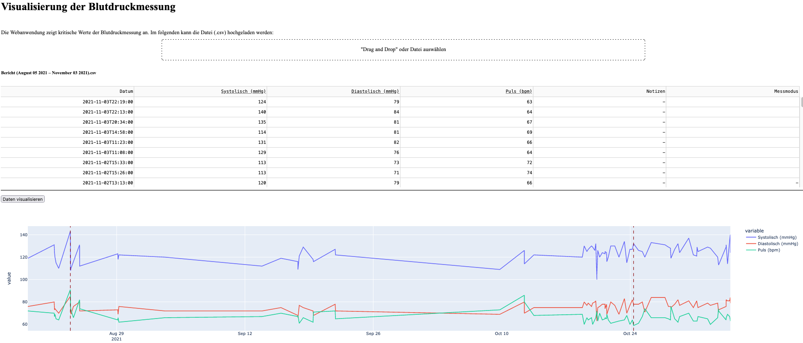

Blood Measurement Dashboard
===========================

Die Webanwendung ermöglicht es Messwerte aus Blutdruckmessungen zu visualisieren. Ziel ist es kritische Werte anhand von Grenzwerten bezogen auf systolische und diastolische Werte und den Puls zu erkennen. 
Die Daten werden beim Upload zur Historisierung in eine Datenbank gespeichert und können dann als Zeitreihendiagramm dargestellt werden.
Das Dashboard wurde mit https://plotly.com/dash/[Dash] entwickelt.

